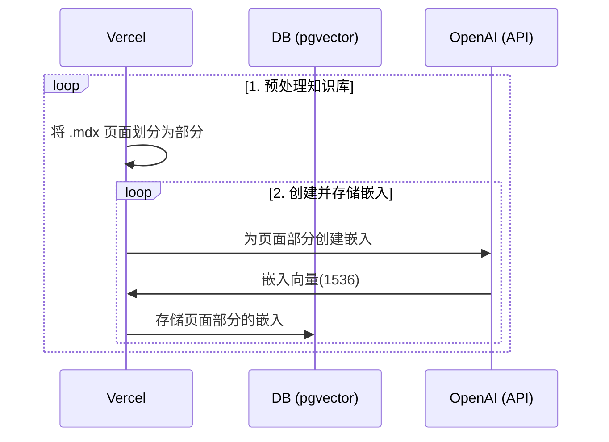
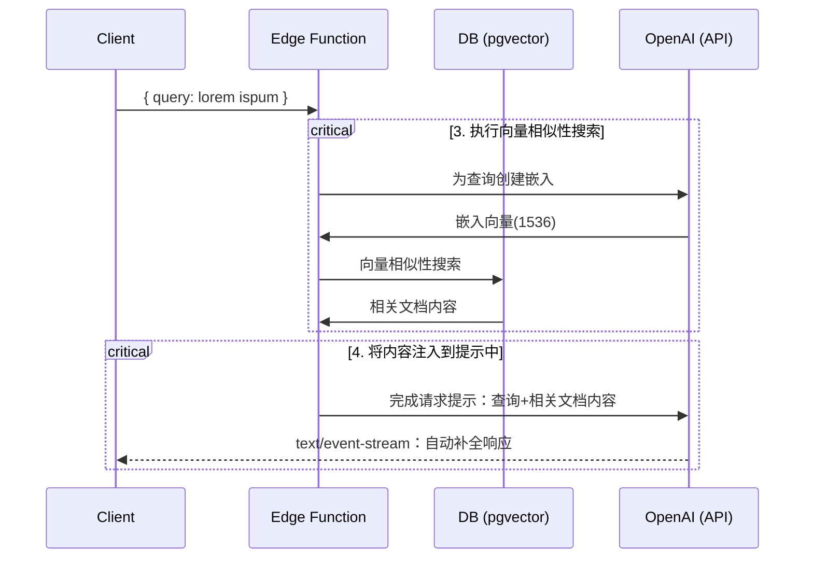

# AI 助手

法律文件来源：https://github.com/LawRefBook/Laws

项目模板：https://github.com/supabase-community/nextjs-openai-doc-search

这个项目从 `pages` 目录中获取所有的 `.mdx` 文件，并将其处理成自定义上下文，以在[OpenAI 文本自动补全](https://platform.openai.com/docs/guides/completion)提示中使用。

## 更多好玩

<table>
  <tr>
    <td width="200px" align="center">
      <a href="https://magickpen.com/?ref=lawcnai" target="_blank">
        
        <p>智能写作助手</p>
      </a>
    </td>
   <td width="200px" align="center">
      <a href="https://www.teach-anything.com/?ref=lawcnai" target="_blank">
        
        <p>AI 百科全书</p>
      </a>
    </td>
    <td width="200px" align="center">
      <a href="https://better.avatarprompt.net/?ref=lawcnai" target="_blank">
        
        <p>Prompt 生成器</p>
      </a>
    </td>
  </tr>
  <tr>
   <td width="200px" align="center">
      <a href="https://openl.io/?ref=lawcnai" target="_blank">
        
        <p>AI 翻译专家</p>
      </a>
    </td>
   <td width="200px" align="center">
      <a href="https://afdian.net/a/lvwzhen/plan" target="_blank">
        <p>❤️ 打赏赞助 ❤️ </p>
      </a>
    </td>
    <td width="200px" align="center">
    </td>
  </tr>
</table>

## 部署

部署此 starter 到 Vercel。Supabase 集成将自动设置所需的环境变量并配置您的[数据库概要](./supabase/migrations/20230406025118_init.sql)。您只需要设置 `OPENAI_KEY`，然后就可以开始了！

[](https://vercel.com/new/clone?demo-title=Next.js%20Law%20CN%20AI&demo-description=Template%20for%20building%20your%20own%20law%20cn%20ai%20powered%20by%20Next.js%2C%20OpenAI%2C%20and%20Supabase.&demo-url=https%3A%2F%2Fsupabase.com%2Fdocs&demo-image=%2F%2Fimages.ctfassets.net%2Fe5382hct74si%2F1OntM6THNEUvlUsYy6Bjmf%2F475e39dbc84779538c8ed47c63a37e0e%2Fnextjs_openai_doc_search_og.png&project-name=Next.js%20OpenAI%20Doc%20Search%20Starter&repository-name=law-cn-ai&repository-url=https%3A%2F%2Fgithub.com%2Flvwzhen%2Flaw-cn-ai%2F&from=github&integration-ids=oac_jUduyjQgOyzev1fjrW83NYOv&env=OPENAI_KEY&envDescription=Get%20your%20OpenAI%20API%20key%3A&envLink=https%3A%2F%2Fplatform.openai.com%2Faccount%2Fapi-keys&teamCreateStatus=hidden&external-id=law-cn-ai)

楼主太懒了，感谢 [GoJun](https://github.com/Freelander) 帮忙写了教程：https://eibot3u32o.feishu.cn/docx/L46Pdp3fjouPUvxaNzPckKctno3

## 技术细节

构建您自己的自定义 ChatGPT 涉及四个步骤：

1. [👷 构建时间] 预处理知识库（您的 `pages` 文件夹中的 `.mdx` 文件）。
2. [👷 构建时间] 在 PostgreSQL 中使用 [pgvector](https://supabase.com/docs/guides/database/extensions/pgvector) 存储嵌入向量。
3. [🏃 运行时] 执行向量相似性搜索，查找与问题相关的内容。
4. [🏃 运行时] 将内容注入到 OpenAI GPT-3 文本自动补全中，并将响应流式传输到客户端。

## 👷 构建时间

步骤 1 和 2 发生在构建时间，例如当 Vercel 构建您的 Next.js 应用程序时。此时执行 [`generate-embeddings`](./lib/generate-embeddings.ts) 脚本，该脚本执行以下任务：



除了存储嵌入向量之外，此脚本还为每个 `.mdx` 文件生成一个校验和，并将其存储在另一个数据库表中，以确保仅当文件更改时才重新生成嵌入向量。

## 🏃 运行时

步骤 3 和 4 在运行时发生，即用户提交问题时。发生这种情况时，执行以下一系列任务：



此为 [`SearchDialog（客户端）`](./components/SearchDialog.tsx)组件和[`vector-search（边缘函数）`](./pages/api/vector-search.ts)负责的相关文件。

数据库的初始化，包括 `pgvector` 扩展的设置存储在 [`supabase/migrations`文件夹](./supabase/migrations/)中，并在运行 `supabase start` 时自动应用于本地 PostgreSQL 实例。

## 本地开发

### 配置

- `cp .env.example .env`
- 在新创建的 `.env` 文件中设置 `OPENAI_KEY`。

### 启动 Supabase

确保已安装并在本地运行 Docker。然后运行

```bash
npx supabase start
```

### 启动 Next.js 应用程序

在新的终端窗口中运行

```bash
pnpm dev
```

## 部署

仅需将此 starter 部署到 Vercel。Supabase 集成将自动设置所需的环境变量并配置您的[数据库 Schema](./supabase/migrations/20230406025118_init.sql)。您只需设置 `OPENAI_KEY` 并开始使用即可！

[](https://vercel.com/new/clone?demo-title=Next.js%20Law%20CN%20AI&demo-description=Template%20for%20building%20your%20own%20law%20cn%20ai%20powered%20by%20Next.js%2C%20OpenAI%2C%20and%20Supabase.&demo-url=https%3A%2F%2Fsupabase.com%2Fdocs&demo-image=%2F%2Fimages.ctfassets.net%2Fe5382hct74si%2F1OntM6THNEUvlUsYy6Bjmf%2F475e39dbc84779538c8ed47c63a37e0e%2Fnextjs_openai_doc_search_og.png&project-name=Next.js%20OpenAI%20Doc%20Search%20Starter&repository-name=law-cn-ai&repository-url=https%3A%2F%2Fgithub.com%2Flvwzhen%2Flaw-cn-ai%2F&from=github&integration-ids=oac_jUduyjQgOyzev1fjrW83NYOv&env=OPENAI_KEY&envDescription=Get%20your%20OpenAI%20API%20key%3A&envLink=https%3A%2F%2Fplatform.openai.com%2Faccount%2Fapi-keys&teamCreateStatus=hidden&external-id=law-cn-ai)

## 了解更多

- 阅读我们如何建立[Supabase 文档的 ChatGPT](https://supabase.com/blog/chatgpt-supabase-docs)的博客帖子。
- [[Docs] pgvector：嵌入和向量相似性](https://supabase.com/docs/guides/database/extensions/pgvector)函数。
- 观看[Greg](https://twitter.com/ggrdson) 关于[Rabbit Hole Syndrome YouTube Channel](https://www.youtube.com/@RabbitHoleSyndrome)的 "How I built this" [video](https://youtu.be/Yhtjd7yGGGA):

[](https://www.youtube.com/watch?v=Yhtjd7yGGGA)

    此文件由 ChatGPT 提供翻译
